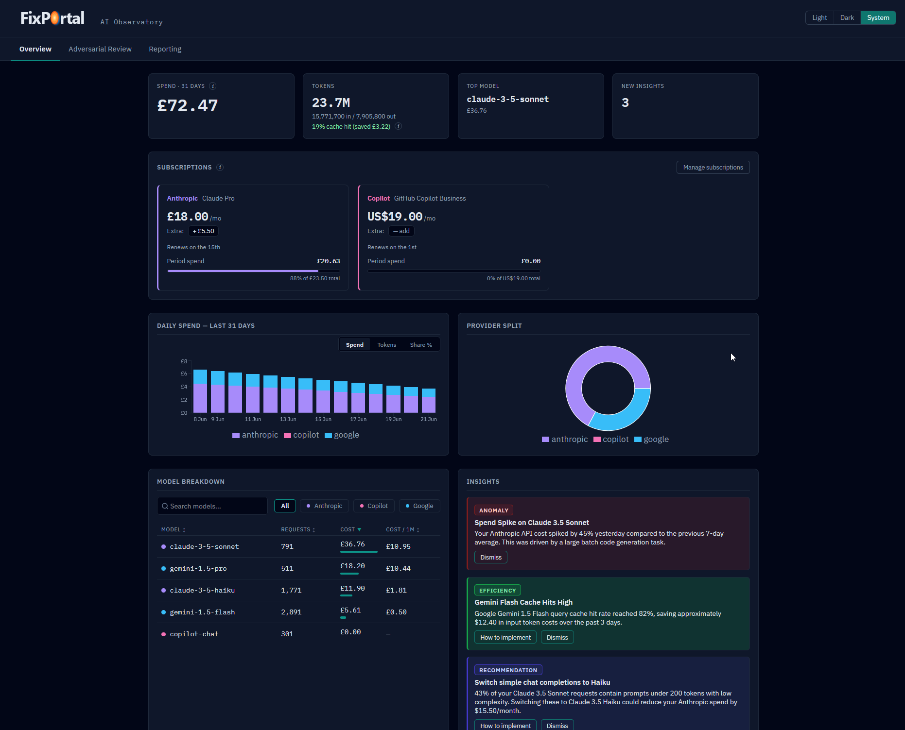
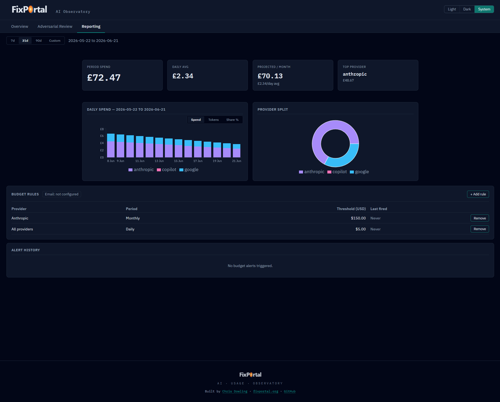

# AI Observatory

> Full-stack observability dashboard for AI service spending. Tracks token usage
> and costs across Anthropic, Google, and GitHub Copilot with AI-generated
> insights, subscription management, and budget alerting. Live at
> [observatory.fixportal.org](https://observatory.fixportal.org).





## What It Does

- Aggregates daily token usage and costs per provider and model
- Displays a 14-day spend trend chart and provider breakdown
- Runs a background intelligence worker that generates anomaly, efficiency, recommendation, and summary insights via the Anthropic SDK
- Manages subscriptions (monthly flat cost + extra usage overlay, progress bar vs. period spend)
- Supports budget rules and FX-rate-aware GBP display

Usage events enter via a `POST /api/events` endpoint, currently fed by a Claude Code `Stop` hook on the developer's machine.

## Tech Stack

| Layer | Technology |
|---|---|
| Frontend | React 19, TypeScript 6, Vite 8 |
| Charts | Recharts 3 (lazy-loaded) |
| Server state | TanStack React Query 5 |
| Styling | Custom CSS + vendored design tokens & components (no Tailwind) |
| Backend | ASP.NET Core 10, Minimal APIs |
| ORM | EF Core 10 + NodaTime |
| Database | PostgreSQL 16 |
| AI insights | Anthropic SDK v5 (`claude-*` models) |
| Hosting | Azure Static Web App (frontend), Azure App Service F1 (API) |
| IaC | Bicep (in `infra/`) |
| Observability | Azure Application Insights |

## Compatibility

| Component | Requirement |
|---|---|
| .NET SDK | 10 (no down-level targets) |
| Node | 22+ |
| PostgreSQL | 16 |
| Azure | App Service F1 + Static Web App Free tier |

## Project Structure

```
fixportal-ai-observatory/
├── .github/
│   └── workflows/
│       ├── ci.yml              # Build & test (PR + main)
│       ├── deploy.yml          # Release to Azure (triggered by CI on main)
│       ├── infra.yml           # Bicep deploy (triggered on infra/** changes)
│       └── react-doctor.yml    # React diagnostics on PRs
├── infra/
│   ├── main.bicep
│   └── modules/
│       ├── appservice.bicep    # fpaiobs-api App Service
│       ├── postgresql.bicep    # fpaiobs-db managed PostgreSQL
│       ├── keyvault.bicep      # fpaiobs-kv secrets
│       ├── appinsights.bicep   # Application Insights
│       └── swa.bicep           # fpaiobs-swa Static Web App
├── src/
│   ├── AiObservatory.Api/      # ASP.NET Core 10 Minimal API
│   ├── AiObservatory.Data/     # EF Core entities, DbContext, migrations
│   └── AiObservatory.Web/      # React 19 frontend
├── tests/
│   ├── AiObservatory.Api.Tests/
│   └── AiObservatory.Data.Tests/
└── AiObservatory.slnx
```

## API Endpoints

All routes are under `/api`. Requests require an `X-Observatory-Key` header
matching the `OBSERVATORY_API_KEY` secret.

| Method | Route | Description |
|---|---|---|
| `GET` | `/api/aggregates` | Daily token usage + cost by provider/model (default: last 31 days) |
| `GET` | `/api/insights` | 50 most recent AI-generated insights |
| `POST` | `/api/insights/{id}/acknowledge` | Mark an insight as read |
| `GET` | `/api/subscriptions` | List billing subscriptions |
| `POST` | `/api/subscriptions` | Create a subscription |
| `PUT` | `/api/subscriptions/{id}` | Update a subscription |
| `PATCH` | `/api/subscriptions/{id}/extra-usage` | Set extra usage cost override |
| `DELETE` | `/api/subscriptions/{id}` | Remove a subscription |
| `GET` | `/api/budget-rules` | List budget alert rules |
| `POST` | `/api/events` | Ingest a raw usage event |

## Frontend Architecture

The frontend (`src/AiObservatory.Web`) is a single-page app served by Azure Static Web App. It calls the API directly (cross-origin — there is no /api proxy on the free SWA tier).

### Code splitting

- React and Recharts ship in separate vendor chunks
- `SpendChart` and `ProviderSplit` are wrapped in `React.lazy()` + `Suspense` so Recharts is never in the initial bundle

### Design system

The app uses a small set of vendored design tokens and UI primitives in `src/design/` — `tokens.css`, `components.css`, and the `BrandWordmark` / `Button` / `Card` / `StatusBadge` / `ThemeToggle` components — copied in so the repo builds standalone with no private package dependency. `src/index.css` imports those tokens for universal surface, text, brand, status, and border values and never redefines them; app-local tokens (provider palette, spacing scale, radius) also live in `src/index.css`.

Provider colours are categorical, not semantic:

| Provider | Light | Dark |
|---|---|---|
| anthropic | `#7c3aed` (violet) | `#a78bfa` |
| google | `#0284c7` (sky) | `#38bdf8` |
| copilot | `#db2777` (rose) | `#f472b6` |
| other | `#64748b` (slate) | `#94a3b8` |

Theming uses `[data-theme="light|dark|system"]` on `<html>`, persisted to `localStorage`.

Depth is expressed through borders only — no box shadows anywhere.

### Insight type → status colour mapping

| Insight type | Status token |
|---|---|
| anomaly | bad |
| efficiency | ok |
| recommendation | info |
| summary | neutral |

## Local Development

### Quick start (Docker)

The fastest way to see a populated dashboard — one command, no local
.NET / Node / PostgreSQL setup needed:

```bash
docker compose up --build
```

This starts PostgreSQL, the API (with EF migrations auto-applied), and the
React frontend served by nginx on [http://localhost:4173](http://localhost:4173).
A one-shot `seed` container fires once the API is healthy and populates 14 days
of sample data.

To supply an Anthropic API key (enables AI insights):

```bash
ANTHROPIC_API_KEY=sk-ant-... docker compose up --build
```

Without the key the API boots fine — AI insights and the `/explain` endpoint
are simply disabled.

To stop and wipe the database volume:

```bash
docker compose down -v
```

### Prerequisites (manual setup)

- .NET 10 SDK
- Node 22+
- PostgreSQL 16 (or Docker)

### Backend

```powershell
cd src/AiObservatory.Api
dotnet run
```

Set these environment variables (or user secrets):

```
DB_CONNECTION=Host=localhost;Database=aiobservatory;Username=...;Password=...
OBSERVATORY_API_KEY=<any-guid>
ANTHROPIC_API_KEY=sk-ant-...   # optional — omit to skip AI insights
```

Run EF Core migrations on first launch or after pulling new migrations:

```powershell
dotnet ef database update --project ../AiObservatory.Data --startup-project .
```

### Frontend

```powershell
cd src/AiObservatory.Web
npm install
npm run dev
```

Set `VITE_API_BASE_URL` in `.env.local` to point at the running API:

```
VITE_API_BASE_URL=http://localhost:5000
```

### Seeding local data

In development mode the API exposes a seed endpoint that wipes the database and
populates 14 days of sample aggregates across Anthropic, Google, and Copilot,
plus subscriptions, budget rules, and three sample insights — the fastest way to
see a fully populated dashboard locally:

```bash
curl -X POST http://localhost:5000/api/dev/seed
```

This endpoint is only available when `ASPNETCORE_ENVIRONMENT=Development` (the
default for `dotnet run`). It is not deployed to production.

### Sending your first event

To ingest a real usage event, `POST /api/events` with an `X-Observatory-Key`
header. In local dev, writes require `OBSERVATORY_API_KEY` to be set in user
secrets; GETs work without a key.

```bash
curl -X POST http://localhost:5000/api/events \
  -H "X-Observatory-Key: <your-key>" \
  -H "Content-Type: application/json" \
  -d '{
    "provider": "anthropic",
    "model": "claude-sonnet-4-6",
    "inputTokens": 1500,
    "outputTokens": 800,
    "cacheReadTokens": 0,
    "cacheWriteTokens": 0,
    "costUsd": 0.012,
    "eventKey": "my-first-event"
  }'
```

Valid providers: `anthropic`, `google`, `copilot`, `openai`. The optional
`eventKey` is an idempotency key — a duplicate key for the same provider is
silently ignored. The optional `occurredAtUtc` backfills the event onto the
correct historical day.

A [Postman collection](docs/ai-observatory.postman_collection.json) covering all
endpoints ships in `docs/`. Import it into Postman, set the `base_url` and
`api_key` collection variables, and run the **Dev / Seed sample data** request
to get a populated dashboard in one click.

### Authentication (production)

Two modes are available; pick one for your deployment.

#### Option A — Entra (Azure AD)

The default for Azure-hosted deployments. The dashboard signs in via Microsoft
redirect — no API key in the browser. A single app registration (`fpaiobs-spa`)
acts as both the SPA and the API it calls; the App Service validates the bearer
token. Machine callers (hooks) keep using the API key.

One-time setup (run as a tenant admin):

```powershell
az login
infra/scripts/setup-entra.ps1
```

It prints `VITE_AAD_CLIENT_ID` / `VITE_AAD_TENANT_ID` / `VITE_AAD_API_SCOPE` for
`src/AiObservatory.Web/.env.production`, and the `aadClientId` for the Bicep
param. Sign-in is restricted to the assigned user.

To use a different tenant (self-hosting): edit the `setup-entra.ps1` defaults or
pass `-TenantId` / `-SubscriptionId` flags and re-run. The script is idempotent.

#### Option B — API key (no Azure AD)

For self-hosters who do not want an Entra app registration. Set a single
environment variable at build time:

```
VITE_API_KEY=<your-OBSERVATORY_API_KEY-value>
```

The UI sends `X-Observatory-Key` on every request instead of a bearer token.
No sign-in screen is shown. The backend already accepts this header from any
caller (it is the same key used by the machine hooks).

Use `OBSERVATORY_READONLY_API_KEY` here if you want the UI to be read-only,
or `OBSERVATORY_API_KEY` for full access.

> **Note:** The key is baked into the frontend bundle at build time and visible
> to anyone who can load the page. Protect access at the network or hosting
> layer (IP allowlist, private VPC, basic-auth reverse proxy) rather than
> relying on the key alone.

#### Local dev

`npm run dev` leaves all auth env vars unset. The app talks directly to
`http://localhost:5000` (or `VITE_API_BASE_URL`) with no credentials — the API
serves GETs without a key in development mode.

### Tests

```powershell
dotnet test                        # all .NET tests
cd src/AiObservatory.Web && npm test   # Vitest unit tests
npm run doctor                         # React Doctor diagnostics

docker run -d --name aiobs-test-pg -e POSTGRES_DB=aiobs_test -e POSTGRES_USER=postgres -e POSTGRES_PASSWORD=postgres -p 5432:5432 postgres:16 # spin up a local docker postgres if you want to unit test all locally
```

## CI / CD

| Workflow | Trigger | What it does |
|---|---|---|
| `ci.yml` | PR + push to main | .NET build + test (PostgreSQL container); npm build |
| `deploy.yml` | CI success on main | Publishes API to `fpaiobs-api` App Service; deploys web to `fpaiobs-swa` SWA |
| `infra.yml` | Push to `infra/**` or manual | `az deployment group create` on `fpaiobs-rg` (westeurope) |
| `react-doctor.yml` | Every PR | React diagnostics with inline PR annotations; fails on error-severity findings |

GitHub Actions secrets required for deployment: `AZURE_CREDENTIALS` (Azure service-principal login) and `SWA_DEPLOYMENT_TOKEN` (Static Web App deploy token). Runtime configuration — the database connection string, `ANTHROPIC_API_KEY`, and `OBSERVATORY_API_KEY` — is supplied to the API App Service via its application settings / Key Vault (pulled at runtime by the managed identity), **not** as GitHub secrets.

## Infrastructure

All Azure resources live in `fpaiobs-rg` (westeurope). Bicep templates in `infra/` are idempotent and redeploy via `infra.yml`.

| Resource | Name | Purpose |
|---|---|---|
| App Service Plan | `fpaiobs-plan` | F1 Free, Linux |
| App Service | `fpaiobs-api` | .NET 10 API |
| PostgreSQL Flexible | `fpaiobs-db` | Production database |
| Key Vault | `fpaiobs-kv` | Secrets (DB string, API keys) |
| Application Insights | `fpaiobs-ai` | Telemetry |
| Static Web App | `fpaiobs-swa` | React frontend → observatory.fixportal.org |

The API App Service uses a system-assigned managed identity to pull secrets from Key Vault at runtime — no secrets in app settings or environment variables.

## Background Intelligence Worker

`IntelligenceWorkerService` runs in-process on the API and periodically analyses recent aggregates to produce insights. It uses the Anthropic SDK (`claude-*`) via `AnthropicIntelligenceClient`, building prompts with `PromptBuilder` and parsing structured responses with `InsightResponseParser`.

Insight types generated:

- **summary** — period overview
- **efficiency** — cost-per-token observations
- **anomaly** — unusual spend spikes or drops
- **recommendation** — actionable optimisation suggestions

Insights are stored in the `Insights` table and surfaced in the `InsightsFeed` component.

## Troubleshooting

| Symptom | Cause | Fix |
|---|---|---|
| Infra deploy fails with `RoleAssignmentUpdateNotPermitted` | App Service was deleted and recreated — Azure prevents updating the immutable `principalId` of an existing role assignment | Delete the stale Key Vault role assignment for the old identity from Key Vault IAM in the portal, then re-run `infra.yml` |
| API returns `401` despite correct key | `OBSERVATORY_API_KEY` env var not set or Key Vault secret not replicated yet | Verify the secret in `fpaiobs-kv`; allow a few minutes after a Key Vault update before the App Service picks it up |
| Frontend shows no data after deploy | `VITE_API_BASE_URL` not set in SWA environment variables | Add `VITE_API_BASE_URL=https://fpaiobs-api.azurewebsites.net` to the SWA application settings |
| EF migrations fail on first run | Database does not yet exist or user lacks `CREATE` privileges | Ensure `DB_CONNECTION` points at an existing PostgreSQL 16 instance with a user that can create tables |
| Entra sign-in loop or `401` after SSO | `aadClientId` Bicep param or `VITE_AAD_*` env vars are stale after app registration recreation | Re-run `infra/scripts/setup-entra.ps1` and redeploy both API and frontend with the new values |
| UI shows no data with `VITE_API_KEY` set | Key baked at build time — runtime env var has no effect | Rebuild the frontend with the env var set; confirm the value matches `OBSERVATORY_API_KEY` or `OBSERVATORY_READONLY_API_KEY` |
| Intelligence worker produces no insights | `ANTHROPIC_API_KEY` missing or invalid | Verify the secret in `fpaiobs-kv`; check Application Insights for `AnthropicIntelligenceClient` exceptions |
| `docker compose up` — seed container exits 1 | API not yet healthy when seed ran, or `OBSERVATORY_API_KEY` mismatch | Run `docker compose up` again; the seed is idempotent. Confirm the key in `docker-compose.yml` matches |
| `docker compose up` — `api` keeps restarting | Database not ready or `DB_CONNECTION` wrong | Check `docker compose logs db`; ensure the `db` healthcheck passes before `api` starts |

## Contributing

Issues and pull requests are welcome. See [CONTRIBUTING.md](CONTRIBUTING.md) for
local setup and the PR checklist, and [CODE_OF_CONDUCT.md](CODE_OF_CONDUCT.md)
for community expectations. In short: branch from `main` as
`feat/<scope>` / `fix/<scope>` / `chore/<scope>`, PRs merge via **rebase** (no
merge commits, no squash), and CI must pass before merging.

The [Postman collection](docs/ai-observatory.postman_collection.json) at
`docs/ai-observatory.postman_collection.json` covers every endpoint and is a
useful companion while exploring or extending the API.

To report a security vulnerability, follow [SECURITY.md](SECURITY.md) — please
do not open a public issue.

## License

[Apache-2.0](LICENSE) © 2026 Chris Dowling. See [NOTICE](NOTICE) for attribution.

## Appendix

### Live endpoints

| Surface | URL |
|---|---|
| Dashboard | `https://observatory.fixportal.org` |
| API | `https://fpaiobs-api.azurewebsites.net` |
| API snapshot | `https://fpaiobs-api.azurewebsites.net/api/aggregates` |

### Azure resources (`fpaiobs-rg`, westeurope)

| Resource | Name |
|---|---|
| Resource group | `fpaiobs-rg` |
| App Service | `fpaiobs-api` |
| App Service Plan | `fpaiobs-plan` |
| PostgreSQL Flexible | `fpaiobs-db` |
| Key Vault | `fpaiobs-kv` |
| Application Insights | `fpaiobs-ai` |
| Static Web App | `fpaiobs-swa` |

### Required GitHub Actions secrets

| Secret | Purpose |
|---|---|
| `AZURE_CREDENTIALS` | Service principal login for `az` CLI in CI |
| `SWA_DEPLOYMENT_TOKEN` | Static Web App deploy token |
